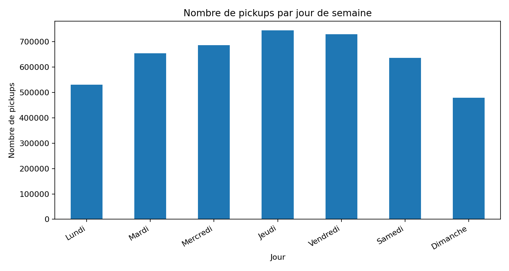
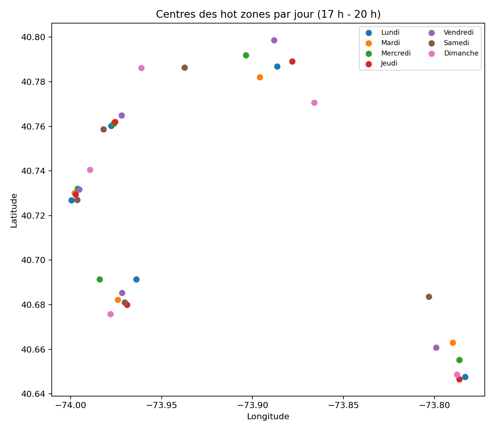

# Uber Pickups — Identification de hot zones à New York

Analyse de la demande Uber à New York par **clustering géospatial non supervisé** afin d'identifier des zones de forte activité et de proposer une lecture opérationnelle par **jour** et par **créneau horaire**.

## Objectif

L'objectif est de répondre à une question simple :

> **Où la demande se concentre-t-elle le plus, et comment transformer cette information en zones d'action lisibles pour le positionnement des chauffeurs ?**

Le projet repose sur deux approches complémentaires :

- **KMeans**, pour obtenir des zones stables, simples à communiquer et faciles à exploiter ;
- **DBSCAN**, pour analyser la densité réelle de la demande et distinguer les points plus isolés.

## Données utilisées

Le travail s'appuie sur les historiques de pickups Uber à New York sur la période **avril à septembre 2014**.

Variables exploitées :
- `Date/Time`
- `Lat`
- `Lon`
- `Base`

Variables dérivées :
- heure,
- jour de semaine,
- indicateur week-end,
- blocs horaires.

> Le dépôt GitHub n'embarque pas le fichier brut `uber-trip-data.zip` afin de rester léger.  
> Pour exécuter le notebook, place ce fichier soit :
> - à la racine du projet ;
> - soit dans un dossier `data/`.

## Démarche retenue

1. chargement des fichiers mensuels depuis l'archive zip ;
2. nettoyage géographique sur le périmètre de New York ;
3. création de variables temporelles ;
4. analyse exploratoire pour identifier les moments les plus structurants ;
5. choix d'un créneau de référence dense ;
6. comparaison de **KMeans** et **DBSCAN** sur ce créneau ;
7. généralisation des résultats à chaque jour de semaine ;
8. synthèse visuelle des centres de hot zones.

## Résultats clés

| Indicateur | Valeur |
|---|---:|
| Pickups bruts chargés | 4 534 327 |
| Pickups conservés après filtre NYC | 4 464 452 |
| Période étudiée | Avril – Septembre 2014 |
| Meilleur `k` retenu pour KMeans | 5 |
| Silhouette KMeans | 0.496 |
| Silhouette DBSCAN (hors bruit) | 0.545 |
| Taux de bruit DBSCAN | ~67 % |

Principaux constats :
- **Manhattan** concentre le cœur de la demande ;
- des zones secondaires récurrentes apparaissent vers **Brooklyn**, **Queens** et certains **axes de transit** ;
- les jours de semaine en **fin de journée** sont particulièrement structurants pour la cartographie des hot zones.

## Aperçu visuel

<p align="center">
  
  
</p>

<p align="center">
  
  
</p>

## Interprétation métier

Les résultats montrent qu'un simple pipeline de clustering peut déjà fournir une aide concrète au pilotage opérationnel :

- pré-positionnement des chauffeurs sur des zones à forte probabilité de demande ;
- différenciation des recommandations selon le jour et le créneau horaire ;
- lecture rapide des noyaux de demande les plus stables.

### Recommandation retenue

- **KMeans** constitue la meilleure base de restitution dans ce contexte, car les centroïdes sont simples à lire et directement utilisables ;
- **DBSCAN** complète utilement l'analyse en révélant les noyaux de densité et la part de bruit, mais se prête moins bien à une restitution régulière et stable.

## Structure du dépôt

```text
.
├── README.md
├── requirements.txt
├── .gitignore
├── assets/
│   ├── centres_hot_zones_par_jour.png
│   ├── pickups_par_heure.png
│   ├── pickups_par_jour.png
│   └── reference_jeudi_17_20.png
└── notebooks/
    ├── uber_hotzones_clean.ipynb
    └── uber_hotzones_executed.ipynb
```

## Installation

```bash
pip install -r requirements.txt
```

## Exécution

```bash
jupyter lab
```

Puis ouvrir l'un des deux notebooks :

- `notebooks/uber_hotzones_clean.ipynb` pour une version légère et relançable ;
- `notebooks/uber_hotzones_executed.ipynb` pour une version avec résultats et sorties visibles.

## Technologies

- Python
- pandas
- numpy
- scikit-learn
- plotly
- matplotlib
- jupyter

## Limites

- la période étudiée reste limitée à 2014 ;
- l'analyse repose uniquement sur les géolocalisations de pickups ;
- les résultats dépendent partiellement des paramètres de clustering ;
- aucune variable externe n'est encore intégrée (météo, événements, trafic, aéroports).

## Pistes d'amélioration

- affiner la segmentation heure par heure ;
- enrichir l'analyse avec des signaux contextuels ;
- projeter les clusters sur des zones opérationnelles fixes ;
- rapprocher l'approche d'une logique de recommandation plus dynamique.

## Conclusion

Le projet montre qu'une approche non supervisée simple, bien cadrée et correctement visualisée permet déjà de transformer un volume massif de pickups en **zones d'action lisibles**. Dans ce cadre, **KMeans** fournit la restitution la plus exploitable, tandis que **DBSCAN** apporte une lecture complémentaire de la densité réelle.
